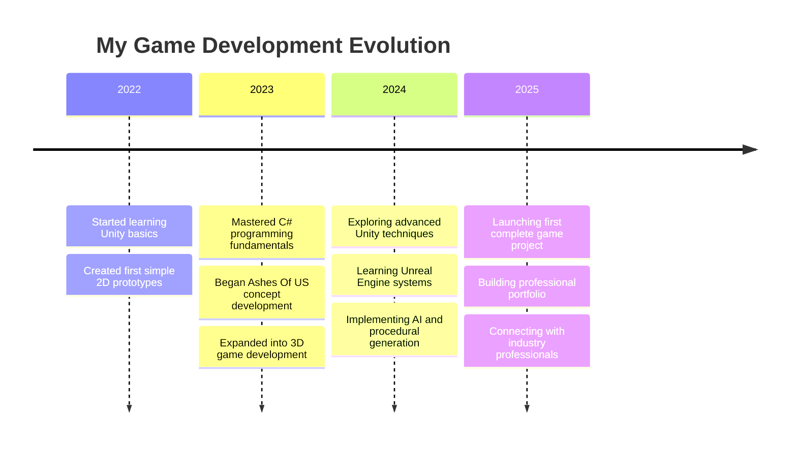

<div align="center">
  
# Muhammad Saim


### *Crafting immersive digital worlds through code and creativity*


</div>

## 👨‍💻 Professional Summary
Dedicated game developer with expertise in Unity and C# development, focused on creating immersive, story-driven experiences. Combining technical skills with creative vision to build games that players don't just play—they experience. Currently balancing game development projects with biotechnology studies, bringing a unique scientific perspective to game mechanics and world-building.

## 🎮 Development Philosophy
```
"Games are not just entertainment—they are interactive art forms that can 
evoke emotions, tell powerful stories, and create lasting memories."
```

## 🛠️ Technical Expertise

<table>
  <tr>
    <th>Category</th>
    <th>Skills</th>
    <th>Proficiency</th>
  </tr>
  <tr>
    <td><b>Game Engines</b></td>
    <td>Unity, Unreal Engine</td>
    <td>⭐⭐⭐⭐☆ | ⭐⭐⭐☆☆</td>
  </tr>
  <tr>
    <td><b>Languages</b></td>
    <td>C#, C++, Python</td>
    <td>⭐⭐⭐⭐☆ | ⭐⭐⭐☆☆ | ⭐⭐⭐☆☆</td>
  </tr>
  <tr>
    <td><b>Game Development</b></td>
    <td>Game Mechanics, Level Design, Gameplay Programming</td>
    <td>⭐⭐⭐⭐☆</td>
  </tr>
  <tr>
    <td><b>Visual Tools</b></td>
    <td>Photoshop, Illustrator, Blender</td>
    <td>⭐⭐⭐☆☆ | ⭐⭐☆☆☆ | ⭐⭐☆☆☆</td>
  </tr>
</table>

## 🚀 Featured Projects

<div align="center">
  <a href="https://github.com/saiouldrading/Ashes-Of-US-">
    
  </a>
  <a href="https://github.com/saiouldrading/GameDav">
    
  </a>
</div>

### Current Project: Ashes Of US
A survival horror experience that challenges players to navigate a post-apocalyptic world filled with both environmental and psychological threats. Inspired by the atmospheric tension of Dying Light and the narrative depth of RDR2.

- **Engine:** Unity with advanced lighting and particle systems
- **Features:** Dynamic AI system, realistic survival mechanics, adaptive difficulty
- **Status:** In active development

## 🌟 Development Journey



## 🧠 Game Design Influences
- **Narrative Design:** Uncharted series, Red Dead Redemption 2
- **Game Mechanics:** Dying Light, Skyrim
- **Visual Style:** Atmospheric horror with realistic elements
- **Player Experience:** Immersive, emotionally engaging gameplay with meaningful choices

## 📊 GitHub Analytics

<div align="center">
  
  
</div>

## 🔍 Currently Learning
- Advanced character animation systems
- Procedural world generation
- Shader programming for realistic visual effects
- AI behavior trees for dynamic enemy encounters
- Performance optimization for complex game worlds

## 🌐 Connect & Collaborate

<div align="center">
  
[](https://www.linkedin.com/in/muhammad-saim-a26349358/)
[](https://www.instagram.com/saimk.k18/)
[](https://github.com/saiouldrading)

</div>

## ✨ Personal Philosophy
> "I don't just create games—I craft experiences that stay with players long after they've put down the controller. Every line of code, every texture, every sound effect is an opportunity to touch someone's life through interactive storytelling."

---

<div align="center">
  <i>Let's build amazing virtual worlds together!</i>
</div>
