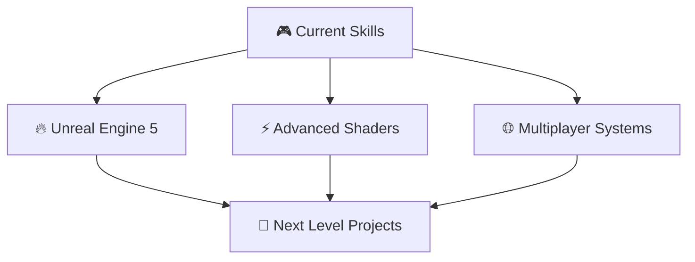

#  **SAI OULDRADING**

<div align="center">


</div>

---

## 🌟 **ABOUT THE ARCHITECT**

<div align="center">
<table>
<tr>
<td width="50%">

```typescript
class GameDeveloper {
  name: "Sai Ouldrading";
  role: "Unity Specialist";
  location: "Digital Realm 🌐";
  
  languages: ["C#", "C++", "Python", "JS"];
  tools: ["Unity", "Blender", "VS Code"];
  
  currentFocus() {
    return "Survival Horror Masterpiece";
  }
  
  lifePhilosophy() {
    return "Turn imagination into reality";
  }
}
```

</td>
<td width="50%">


</td>
</tr>
</table>
</div>

---

## ⚡ **POWER STACK**

<div align="center">

### 🎮 **Game Development Arsenal**


<br>


</div>

---


---
## 🚧 **CURRENT PROJECT: ASHES OF US**

<div align="center">


<br>
**2D Story-Driven Post-Apocalyptic Zombie Survival Game**

| 🎯 **FEATURE** | 🏆 **STATUS** | 📈 **PROGRESS** |
|:---|:---:|:---:|
| 🧟 **Realistic Combat System** | In Development | 70% |
| 📖 **Character Development** | Active | 85% |
| 🌍 **World Building** | Design Phase | 60% |
| 🎬 **Cinematic Storytelling** | Scripting | 50% |

</div>

### 🎭 **MAIN CHARACTERS**

<div align="center">

<table>
<tr>
<td width="50%" align="center">

<br><sub><b>Silent Ex-Military | Guilt-Driven Survivor</b></sub>
</td>
<td width="50%" align="center">

<br><sub><b>Hopeful Dreamer | The Heart of Hope</b></sub>
</td>
</tr>
</table>

</div>

### 📋 **DEVELOPMENT ROADMAP**
- 🎯 **30-minute playable demo** targeting completion in **6 months**
- 👥 **2-person indie team** handling all development aspects
- 🎨 **Complete in-house production** - programming, design, characters & assets
- 🎮 **Focus on tactical combat, emotional storytelling & atmospheric immersion**

---

## 🎮 **GAMING INSPIRATION SESSIONS**

<div align="center">

| 🎯 **NOW PLAYING** | 🏆 **STATUS** |
|:---|:---:|
| 🧟 **Dying Light The Beast** | Active Session | Combat Mechanics Study |
| 🤠 **Red Dead Redemption 2** | Story Mode | Character Development Research |
| ⚽ **FIFA 19** | Playing Manager Mode | Quick Gaming Breaks |
| 🗺️ **Uncharted 4** | Treasure Hunt | Narrative Structure Analysis |

</div>

## 📊 **DEVELOPER ANALYTICS**

<div align="center">


</div>

---

## 💭 **DEVELOPER PHILOSOPHY**

<div align="center">

> ### *"Code is poetry written in logic"* 🎭
> ### *"Every bug is a puzzle waiting to be solved"* 🧩
> ### *"Dream in code, build in reality"* 💫

</div>

---

## 🎮 **CURRENT GAMING SESSION**

<div align="center">

| 🎯 **NOW PLAYING** | 🏆 **STATUS** | 📈 **PROGRESS** |
|:---|:---:|:---:|
| 🧟 **Dying Light The Beast** | Active Session | 
| 🤠 **Red Dead Redemption 2** | Story Mode |
| ⚽ **FIFA 23** | Online Seasons | 
| 🗺️ **Uncharted 4** | Treasure Hunt | 

</div>

---

## 🎯 **LEARNING ROADMAP 2024**

<div align="center">



<table>
<tr>
<td width="33%" align="center">

<br>**Meta-Human Integration**
</td>
<td width="33%" align="center">

<br>**Visual Effects Mastery**
</td>
<td width="33%" align="center">

<br>**Multiplayer Architecture**
</td>
</tr>
</table>

</div>

---

## 🤝 **CONNECT & COLLABORATE**

<div align="center">

<a href="https://www.linkedin.com/in/muhammad-saim-a26349358/">

</a>
<a href="https://www.instagram.com/saimk.k18/">

</a>
<a href="mailto:Ouldrading@gmail.com">

</a>

### 🌟 **Open For:**
`🎮 Game Jams` • `💡 Creative Projects` • `🤝 Technical Collaborations` • `🚀 Startup Ideas`

</div>

---

## 🎨 **SIGNATURE QUOTE**

<div align="center">


</div>

---

<div align="center">


### 🎯 **"Building tomorrow's gaming experiences, one line of code at a time!"**


</div>

---

<div align="center">

**⭐ From one developer to another - keep pushing the boundaries! ⭐**


</div>
