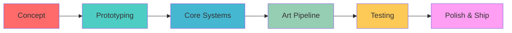

# 🎮 Sai Ouldrading
**`Senior Game Developer | Unity Architect | Interactive Systems Designer`**


[](https://github.com/saiouldrading)
[](https://www.linkedin.com/in/muhammad-saim-a26349358/)
[](https://www.instagram.com/saimk.k18/)

---

## 🛠️ Development Stack

<details open>
<summary><b>🎯 Game Engines</b></summary>
<br>


</details>

<details open>
<summary><b>⚡ Programming Languages</b></summary>
<br>


</details>

<details open>
<summary><b>🎨 Creative Tools</b></summary>
<br>


</details>

---

## 🎮 Specialization Matrix

```
┌─────────────────┬─────────────────┬─────────────────┐
│ SURVIVAL HORROR │   OPEN WORLD    │   ACTION RPG    │
├─────────────────┼─────────────────┼─────────────────┤
│ ████████████ 95%│ ██████████░░ 80%│ ████████░░░░ 70%│
│                 │                 │                 │
│ • Horror Systems│ • World Building│ • Combat Design │
│ • AI Behavior   │ • Procedural    │ • RPG Mechanics │
│ • Atmosphere    │ • Exploration   │ • Character Dev │
└─────────────────┴─────────────────┴─────────────────┘
```

---

## 🏆 Game Development Influences

<table>
<tr>
<td align="center" width="20%">

<br><sub><b>Day/Night Cycles</b></sub>
<br><sub>Dynamic Tension</sub>
</td>
<td align="center" width="20%">

<br><sub><b>Living Worlds</b></sub>
<br><sub>NPC Ecosystems</sub>
</td>
<td align="center" width="20%">

<br><sub><b>Cinematic Flow</b></sub>
<br><sub>Adventure Pacing</sub>
</td>
<td align="center" width="20%">

<br><sub><b>Player Freedom</b></sub>
<br><sub>Deep Systems</sub>
</td>
<td align="center" width="20%">

<br><sub><b>Physics Engine</b></sub>
<br><sub>Fluid Motion</sub>
</td>
</tr>
</table>

---

## 📈 GitHub Analytics

<p align="center">


</p>

<p align="center">

</p>

---

## 🚀 Current Development Pipeline



**🎯 Active Projects:**
- `Project: Nightfall` - Psychological Survival Horror
- `VR Prototype` - Immersive Experience Engine  
- `Indie Pipeline` - Complete Development Framework

---

## 🔧 Development Philosophy

```cpp
class GameDeveloper : public Artist, public Engineer {
private:
    std::vector<std::string> passions = {
        "Player Experience",
        "Technical Innovation", 
        "Artistic Vision",
        "Performance Optimization"
    };
    
public:
    void CreateMasterpiece() {
        while(inspired) {
            Design();
            Code(); 
            Test();
            Iterate();
        }
        Ship();
    }
};
```

---

## 📊 Skill Progression


**Current Learning Path:**
- Advanced Unity DOTS System
- Unreal Engine 5 Nanite & Lumen
- Procedural Generation Algorithms
- VR/AR Development Patterns
- Game Performance Profiling

<br clear="left"/>

---

## 🤝 Let's Collaborate

```bash
git clone https://github.com/your-ideas.git
cd ./our-next-project
git commit -m "Building the future of gaming"
git push origin master
```

**Open to:**
- 🎮 Indie Game Collaborations
- 🛠️ Technical Consulting
- 🎨 Creative Partnerships
- 📚 Knowledge Sharing

---

<div align="center">

**"Every line of code is a brushstroke on the canvas of imagination"**


[](https://github.com/saiouldrading)

</div>
