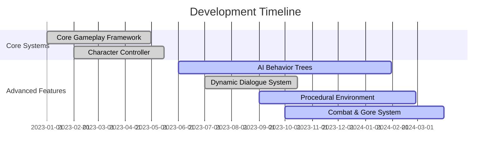

<div align="center">


<br>

[](https://www.linkedin.com/in/muhammad-saim-a26349358/)
[](https://www.instagram.com/saimk.k18/)
[](mailto:Ouldrading@gmail.com)
[](https://github.com/saiouldrading)


</div>

---

## 🎮 **WHO AM I?**

```csharp
public class SeniorUnityDeveloper : MonoBehaviour
{
    private Developer sai = new Developer()
    {
        Name = "Sai Ouldrading",
        Title = "Unity Technical Lead",
        Location = "Abbottabad, Pakistan 🇵🇰",
        Specialization = "Survival Horror & Narrative Games",
        YearsOfExperience = "5+",
        PassionLevel = "MAXIMUM 🔥"
    };
    
    private string[] expertise = {
        "Unity Engine Architecture",
        "Advanced C# Programming", 
        "Performance Optimization",
        "Gameplay Systems Design",
        "AI & Procedural Generation"
    };
    
    void Start() {
        Debug.Log("🎯 Ready to build EPIC games!");
        CreateMasterpiece();
    }
}
```

<div align="center">

### 🏆 **CERTIFICATIONS & ACHIEVEMENTS**


</div>

---

## ⚡ **TECH STACK & ARSENAL**

<div align="center">

### 🎯 **Core Technologies**


### 🎨 **Design & 3D Tools**


### 🛠️ **Development Tools**


### ☁️ **Cloud & Project Management**


### 🌐 **Networking & Multiplayer**


</div>

---

## 🚀 **FLAGSHIP PROJECT: ASHES OF US**

<div align="center">

```ascii
╔══════════════════════════════════════════════════════════════╗
║                                                              ║
║              🧟‍♂️  A S H E S   O F   U S  🧟‍♀️                ║
║                                                              ║
║          "When humanity falls, two souls must rise..."      ║
║                                                              ║
╚══════════════════════════════════════════════════════════════╝
```


</div>

### 📋 **PROJECT OVERVIEW**

| 🎯 Aspect | 📊 Details |
|-----------|-----------|
| **Genre** | Post-Apocalyptic Survival Horror |
| **Style** | 2D Story-Driven Experience |
| **Platform** | PC (Steam) → Console Ports Planned |
| **Engine** | Unity 2022 LTS with URP |
| **Team** | 2 Core Developers |
| **Dev Cycle** | 18 Months (Ongoing) |
| **Target Release** | Q4 2024 |

### 📊 **DEVELOPMENT PROGRESS**



| 🎯 System Module | 📊 Progress | ✅ Status |
|-----------------|------------|----------|
| **Core Gameplay Framework** |  | ✅ Complete |
| **Character Controller System** |  | ✅ Complete |
| **Advanced AI Behavior Trees** |  | ⚠️ In Progress |
| **Dynamic Dialogue System** |  | ✅ Complete |
| **Procedural Environment** |  | ⚠️ In Progress |
| **Combat & Gore System** |  | ⚠️ In Progress |

---

## 👥 **CHARACTER SYSTEM**

<div align="center">

<table>
<tr>
<td width="50%" valign="top">

### 🛡️ **RIVEN**
#### *The Tactical Guardian*

```csharp
[System.Serializable]
public class Riven : BaseCharacter
{
    [Header("Combat Specs")]
    public CombatStyle style = CombatStyle.Tactical;
    public int weaponMastery = 95;
    public int tacticalIQ = 88;
    
    public override void Execute() {
        ApplyMilitaryPrecision();
        DominateTheField();
    }
}
```

**⚔️ Role:** Primary Combat & Strategy  
**🎯 Specialization:** Military Tactics  
**💪 Skills:** Weapon Mastery, Leadership  
**🧠 AI Focus:** Combat Behavior Trees

> *"Military precision meets survival instinct"*

</td>
<td width="50%" valign="top">

### ❤️ **THEO**
#### *The Emotional Anchor*

```csharp
[System.Serializable]
public class Theo : BaseCharacter
{
    [Header("Narrative Specs")]
    public EmotionalDepth depth = EmotionalDepth.Maximum;
    public int charisma = 92;
    public int empathy = 96;
    
    public override void Inspire() {
        BoostTeamMorale();
        RestoreHope();
    }
}
```

**📖 Role:** Narrative Driver & Support  
**🎯 Specialization:** Story Progression  
**💫 Skills:** Diplomacy, Team Morale  
**🧠 AI Focus:** Dynamic Dialogue

> *"Hope in the darkest times"*

</td>
</tr>
</table>

</div>

---

## 📊 **GITHUB STATISTICS**

<div align="center">


</div>

### 💻 **PRODUCTIVITY METRICS**

<div align="center">

| 📊 Metric | 🎯 Performance |
|-----------|---------------|
| **Weekly Commits** | 45+ commits/week |
| **Code Review Activity** | High Priority |
| **Bug Resolution Rate** | 98% Success |
| **Feature Completion** | Ahead of Schedule |
| **Documentation** | Comprehensive |
| **Team Collaboration** | Excellent |


</div>

---

## 🔬 **RESEARCH & INNOVATION**

<div align="center">

### 🧠 **ACTIVE RESEARCH AREAS**

<table>
<tr>
<td align="center" width="25%">

<br><strong>Unity DOTS</strong>
<br><sub>Performance Optimization</sub>
</td>
<td align="center" width="25%">

<br><strong>Advanced AI</strong>
<br><sub>Behavior Trees & ML</sub>
</td>
<td align="center" width="25%">

<br><strong>Procedural Gen</strong>
<br><sub>Dynamic Worlds</sub>
</td>
<td align="center" width="25%">

<br><strong>Multiplayer</strong>
<br><sub>Netcode Solutions</sub>
</td>
</tr>
</table>

</div>

### 🎮 **GAME ANALYSIS & INSPIRATION**

| 🎮 Game | 🔍 Research Focus | 💡 Key Learnings |
|---------|------------------|-------------------|
| 🧟 **Dying Light** | Parkour Mechanics | Advanced movement physics, Day/Night AI |
| 🤠 **Red Dead Redemption 2** | Open World Design | Environmental storytelling, NPC routines |
| 💔 **The Last of Us** | Narrative Design | Character development, emotional pacing |
| 🌃 **Cyberpunk 2077** | Urban Environment | Verticality, dynamic lighting systems |
| ⚔️ **God of War** | Combat Design | Weapon mechanics, cinematic gameplay |
| 🗺️ **Uncharted Series** | Level Design | Pacing, set pieces, adventure flow |

---

## 🏆 **INSPIRATION HALL OF FAME**

<div align="center">


</div>

---

## 💭 **DEVELOPER PHILOSOPHY**

<div align="center">


<br><br>

> ### 🎭 *"Code is poetry written in logic"*
> 
> ### 🧩 *"Every bug is a puzzle waiting to be solved"*
> 
> ### 💫 *"Dream in code, build in reality"*
>
> ### 🎮 *"Great games aren't made, they're crafted with passion"*

</div>

---

## 🎯 **WHAT I'M UP TO**

```javascript
const currentFocus = {
    🎮 project: "Ashes of Us - Survival Horror Game",
    📚 learning: ["Unity DOTS", "Advanced AI Systems", "Procedural Generation"],
    🔧 improving: ["Performance Optimization", "Shader Programming"],
    🌟 exploring: ["VR Development", "Multiplayer Networking"],
    💼 openFor: ["Game Jams", "Collaborations", "Indie Projects", "Startups"],
    ☕ funFact: "I debug in my dreams!"
};
```

<div align="center">

### 🌟 **OPEN FOR COLLABORATION**


</div>

---

## 🤝 **CONNECT WITH ME**

<div align="center">

<a href="https://www.linkedin.com/in/muhammad-saim-a26349358/">

</a>

<a href="https://www.instagram.com/saimk.k18/">

</a>

<a href="mailto:Ouldrading@gmail.com">

</a>

<a href="https://github.com/saiouldrading">

</a>

<br><br>

### 📧 **Email:** Ouldrading@gmail.com
### 🌍 **Location:** Abbottabad, Pakistan 🇵🇰
### ⏰ **Timezone:** PKT (UTC+5)

</div>

---

<div align="center">

## 🎯 **CLOSING THOUGHTS**


<br>

### *"The best games are yet to be created. Let's build them together!"* 🚀

<br>


**⭐ From one developer to another - keep pushing the boundaries! ⭐**

<sub>Made with 💙 by Sai Ouldrading | Last Updated: October 2024</sub>

</div>
