#  **SAI OULDRADING**

<div align="center">


</div>

---

## 🌟 **ABOUT THE ARCHITECT**

<div align="center">
<table>
<tr>
<td width="50%">

```typescript
class GameDeveloper {
  name: "Sai Ouldrading";
  role: "Unity Specialist";
  location: "Digital Realm 🌐";
  
  languages: ["C#", "C++", "Python", "JS"];
  tools: ["Unity", "Blender", "VS Code"];
  
  currentFocus() {
    return "Survival Horror Masterpiece";
  }
  
  lifePhilosophy() {
    return "Turn imagination into reality";
  }
}
```

</td>
<td width="50%">


</td>
</tr>
</table>
</div>

---

## ⚡ **POWER STACK**

<div align="center">

### 🎮 **Game Development Arsenal**


<br>

</div>

---

## 🌟 **CURRENT MASTERPIECE IN DEVELOPMENT**

<div align="center">

```ascii
╔══════════════════════════════════════════════════════════╗
║    🧟‍♂️ A S H E S   O F   U S 🧟‍♀️                        ║
║                                                          ║
║  "When humanity falls, two souls must rise..."          ║
╚══════════════════════════════════════════════════════════╝
```


</div>

## 🏆 **INSPIRATION HALL OF FAME**

<div align="center">

<table>
<tr>
<td align="center" width="25%">

<br><sub><b>Parkour Horror</b></sub>
</td>
<td align="center" width="25%">

<br><sub><b>Open World Excellence</b></sub>
</td>
<td align="center" width="25%">

<br><sub><b>Adventure Mastery</b></sub>
</td>
<td align="center" width="25%">

<br><sub><b>Future Vision</b></sub>
</td>
</tr>
</table>

</div>

---

### 🎭 **THE SURVIVORS**

<div align="center">

<table>
<tr>
<td width="50%">

```typescript
interface Character {
  name: "RIVEN";
  archetype: "The Haunted Guardian";
  background: "Ex-Military Officer";
  traits: ["Silent", "Tactical", "Guilt-Ridden"];
  specialty: "Combat & Survival";
  
  backstory() {
    return "Shadows of past failures drive him forward";
  }
}
```

</td>
<td width="50%">

```typescript
interface Character {
  name: "THEO";
  archetype: "The Light Bearer";
  background: "Innocent Dreamer";
  traits: ["Hopeful", "Vulnerable", "Inspiring"];
  specialty: "Emotional Anchor";
  
  backstory() {
    return "In darkness, he still dreams of dawn";
  }
}
```

</td>
</tr>
</table>

</div>

---

### 🎯 **DEVELOPMENT BATTLE STATION**

```mermaid
flowchart TD
    A[🎮 GAME CONCEPT] --> B[🎨 2-PERSON INDIE TEAM]
    B --> C[⚔️ TACTICAL COMBAT]
    B --> D[📖 EMOTIONAL NARRATIVE]
    B --> E[🌍 ATMOSPHERIC WORLD]
    C --> F[🚀 30-MIN DEMO]
    D --> F
    E --> F
    F --> G[🏆 6 MONTH TARGET]
    
    style A fill:#ff4444
    style F fill:#00ff00
    style G fill:#ffaa00
```

<div align="center">



</div>

### ⚡ **CURRENT DEV STATUS**

<div align="center">

| 🎯 **SYSTEM** | 🔥 **VIBE CHECK** | 📊 **COMPLETION** |
|:---|:---:|:---:|
| 🧟 **Gore Combat System** | `CODING INTENSELY` | 70% |
| 🎭 **Character Souls** | `BREATHING LIFE` | 85% |
| 🌆 **Post-Apocalyptic World** | `WORLD BUILDING` | 60% |
| 🎬 **Cinematic Moments** | `SCRIPTING MAGIC` | 50% |

</div>

---

### 🔥 **THE INDIE GRIND**

<div align="center">

> ### 💀 *"Two developers. One vision. Zero budget. Infinite passion."* 🔥
> 
> **🎮 Complete In-House Production** • **⚔️ Tactical Combat Focus** • **💔 Emotional Storytelling**
> 
> **🎯 MISSION**: Deliver a gut-wrenching 30-minute experience that'll make players question everything

</div>

---

## Now Playing

<div align="center">

| 🎯 **NOW PLAYING** | 🏆 **STATUS** | 📈 **RESEARCH PURPOSE** |
|:---|:---:|:---:|
| 🧟 **Dying Light The Beast** | Active Session | Combat Mechanics Study |
| 🤠 **Red Dead Redemption 2** | Story Mode | Character Development Research |
| ⚽ **FIFA 19** | Playing Manager Mode | Quick Gaming Breaks |
| 🗺️ **Uncharted 4** | Treasure Hunt | Narrative Structure Analysis |

</div>

---

## 📊 **DEVELOPER ANALYTICS**

<div align="center">


</div>

---

## 💭 **DEVELOPER PHILOSOPHY**

<div align="center">

> ### *"Code is poetry written in logic"* 🎭
> ### *"Every bug is a puzzle waiting to be solved"* 🧩
> ### *"Dream in code, build in reality"* 💫

</div>

---

## 🤝 **CONNECT & COLLABORATE**

<div align="center">

<a href="https://www.linkedin.com/in/muhammad-saim-a26349358/">

</a>
<a href="https://www.instagram.com/saimk.k18/">

</a>
<a href="mailto:Ouldrading@gmail.com">

</a>

### 🌟 **Open For:**
`🎮 Game Jams` • `💡 Creative Projects` • `🤝 Technical Collaborations` • `🚀 Startup Ideas`

</div>

---

## 🎨 **SIGNATURE QUOTE**

<div align="center">


</div>

---

<div align="center">


### 🎯 **"Building tomorrow's gaming experiences, one line of code at a time!"**


</div>

---

<div align="center">

**⭐ From one developer to another - keep pushing the boundaries! ⭐**

</div>
