<div align="center">

# 🎮 Sai Ouldrading
**`GAME DEVELOPER • UNITY WIZARD • DIGITAL WORLD ARCHITECT`**


</div>

---

<div align="center">

## 🚀 **DEVELOPER MATRIX**


</div>

<table align="center">
<tr>
<td align="center" width="25%">

<br><b>UNITY ENGINE</b>
<br>
</td>
<td align="center" width="25%">

<br><b>C# WIZARDRY</b>
<br>
</td>
<td align="center" width="25%">

<br><b>3D ARTISTRY</b>
<br>
</td>
<td align="center" width="25%">

<br><b>UNREAL UE5</b>
<br>
</td>
</tr>
</table>

<div align="center">

### 🛠️ **THE ARSENAL**


</div>

---

<div align="center">

## 🎯 **GAME GENRE MASTERY**


</div>

```ascii
╔══════════════════════════════════════════════════════════════════╗
║  🧟 SURVIVAL HORROR    🌍 OPEN WORLD RPG    ⚔️ ACTION COMBAT     ║
║  ████████████████▓░    ██████████████▓░░    ████████████▓░░░     ║
║  Psychological Terror  Living Ecosystems    Fluid Combat Systems ║
╚══════════════════════════════════════════════════════════════════╝
```

<div align="center">

### 🏆 **LEGENDARY INSPIRATIONS**

<table>
<tr>
<td align="center">

<br><sub><i>Dynamic Day/Night Systems</i></sub>
</td>
<td align="center">

<br><sub><i>Living World Mechanics</i></sub>
</td>
<td align="center">

<br><sub><i>Cinematic Adventures</i></sub>
</td>
<td align="center">

<br><sub><i>Endless Exploration</i></sub>
</td>
<td align="center">

<br><sub><i>Realistic Physics</i></sub>
</td>
</tr>
</table>

</div>

---

<div align="center">

## 📊 **DEVELOPER ANALYTICS**


</div>

<p align="center">


</p>

<p align="center">

</p>

<div align="center">

### 🎮 **DEVELOPMENT ACTIVITY**


</div>

---

<div align="center">

## 🚀 **MISSION CONTROL**

```
┌─ CURRENT PROJECTS ──────────────────────────────────────────┐
│                                                             │
│  🎯 PROJECT NIGHTFALL     ████████████████░░░░  [80%]      │
│     └─ Survival Horror Experience                           │
│                                                             │
│  ⚡ VR PROTOTYPE          ██████████░░░░░░░░░░  [50%]      │
│     └─ Next-Gen Immersive Systems                           │
│                                                             │
│  🏗️ INDIE STUDIO SETUP   ██████████████████████  [100%]    │
│     └─ Complete Dev Pipeline                                │
│                                                             │
└─────────────────────────────────────────────────────────────┘
```

</div>

---

<div align="center">

## 🎨 **CREATIVE PROCESS**

```mermaid
graph TB
    A[💡 CONCEPT] -->|Brainstorm| B[📝 DESIGN DOC]
    B -->|Architecture| C[🏗️ PROTOTYPING]
    C -->|Core Systems| D[⚙️ DEVELOPMENT]
    D -->|Assets| E[🎨 ART PIPELINE]
    E -->|Integration| F[🔧 TESTING]
    F -->|Polish| G[✨ LAUNCH]
    
    style A fill:#FF6B6B,stroke:#FF6B6B,color:#fff
    style B fill:#4ECDC4,stroke:#4ECDC4,color:#fff
    style C fill:#45B7D1,stroke:#45B7D1,color:#fff
    style D fill:#96CEB4,stroke:#96CEB4,color:#fff
    style E fill:#FECA57,stroke:#FECA57,color:#fff
    style F fill:#FF9FF3,stroke:#FF9FF3,color:#fff
    style G fill:#54A0FF,stroke:#54A0FF,color:#fff
```


</div>



---

<div align="center">

## 💻 **CODE PHILOSOPHY**


</div>

```cpp
namespace GameDevelopment {
    class SaiOuldrading : public GameDeveloper {
    private:
        std::vector<std::string> passions = {
            "🎮 Player Experience First",
            "⚡ Performance Optimization", 
            "🎨 Artistic Vision",
            "🔧 Clean Architecture"
        };
        
    public:
        void CreateMasterpiece() {
            while(dreaming && coding) {
                Innovate();
                Build(); 
                Test();
                Iterate();
            }
            LaunchEpicGame();
        }
        
        std::string GetMotivation() {
            return "Building worlds that players never want to leave! 🌟";
        }
    };
}
```

---

<div align="center">

## 🤝 **COLLABORATION ZONE**


[](https://www.linkedin.com/in/muhammad-saim-a26349358/)
[](https://www.instagram.com/saimk.k18/)
[](#)
[](#)

### 🎯 **OPEN FOR:**
- 🕹️ **Indie Game Collaborations**
- 🛠️ **Technical Game Dev Consulting** 
- 🎨 **Creative Partnerships**
- 📚 **Knowledge Sharing & Mentoring**

</div>

---

<div align="center">

## 🏆 **ACHIEVEMENT UNLOCKED**

```
🎮 GAMES DEVELOPED: Loading...
⭐ GITHUB CONTRIBUTIONS: 500+  
🔥 LINES OF CODE: 50,000+
☕ COFFEE CONSUMED: Infinite
```


[](https://github.com/saiouldrading)

</div>

---

<div align="center">


### 🎯 **"Every pixel tells a story, every line of code builds a dream!"** 


</div>
